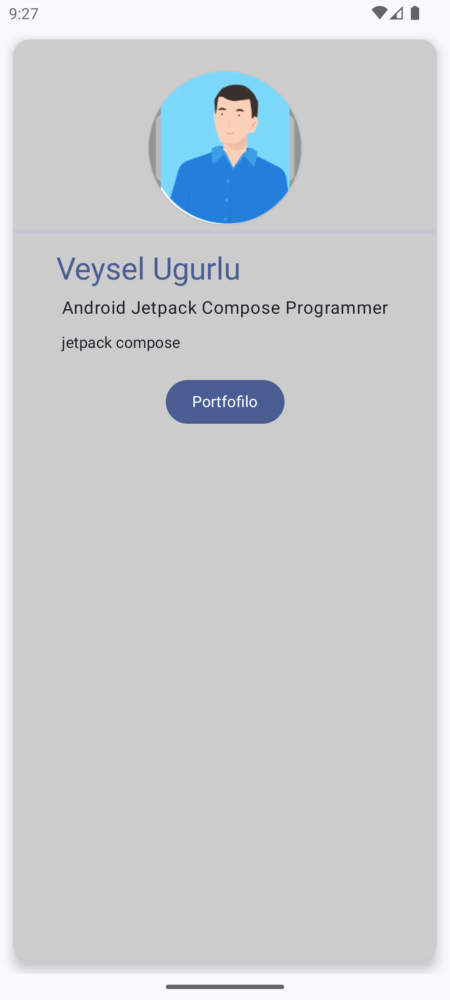

# 🚀 Kotlin Projects

This repository contains multiple projects built using *Kotlin* and *Jetpack Compose*.  
Each project is designed to demonstrate different UI components, architectural patterns, and best practices in Android development.

> 🛠 *Note:* This repository is a work in progress and will continue to be updated over time.

---

## 📱 Projects Overview

## 1.Biz Card App  
📇💰📇 A simple business card layout built using Jetpack Compose.

*Screenshots:*  

  
  

---

## 2.Jet Tip App  
📇💰 A tip calculator app that helps users split bills and calculate tips.

*Screenshots:*  

  
  
   
   

---

## 3. Note App  
📝 A simple note-taking app built using Jetpack Compose.

*Screenshots:*  

  
  
  
  

---

## 4. Trivia App  
❓ A quiz/trivia app that fetches questions and tracks your score.

*Screenshots:*  

  
  
  
  

---

## 📬 Contact

Made with ❤ by [Veysel Uğurlu](https://github.com/VeyselUgurlu)  
Feel free to open an issue or reach out if you have feedback or questions!
